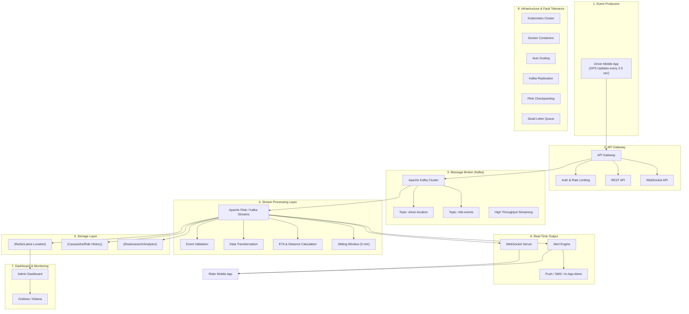

# Real-Time Ride Tracking System 📡

> **A real-time stream processing system that simulates live ride tracking like Uber using Python and modern web technologies.** 🚀

---

## 📝 Introduction

This project demonstrates the core principles of **Stream Processing** and **Event-Driven Architecture**. It simulates a ride-tracking environment where multiple drivers generate high-frequency GPS data, which is then processed in real-time to provide analytics, ETA calculations, and safety alerts.

By using a localized "Message Broker" and a multi-threaded processing engine, this system showcases:
- **Real-time data ingestion**: Handling continuous streams of driver location updates.
- **Event-driven architecture**: Decoupling data production (drivers) from data processing.
- **Low latency processing**: Calculating metrics and ETAs with sub-second lag.

---

## ✨ Features

- 📡 **Live GPS Tracking Simulation**: Multiple drivers moving realistically through Mumbai streets.
- ⚡ **Real-Time Updates**: UI updates every 2 seconds via a lightweight data polling system.
- 🔄 **Kafka Simulation**: Uses a thread-safe `queue.Queue` to simulate a message broker.
- 🪟 **Sliding Window Computation**: Calculates average speeds based on the last 5 events per driver.
- ⏱️ **ETA Calculation**: Dynamic arrival time estimation based on distance and current speed.
- ⚠️ **Alert System**: 
    - **Over-speeding**: Instant flags for drivers exceeding 80 km/h.
    - **Driver Stopped**: Detects if a driver hasn't moved for multiple updates.
- 📊 **Dashboard Metrics**: Live view of speed, distance traveled, and active driver count.

---

## 🛠️ Tech Stack

### **Backend**
- **Python**: Core logic and simulation engine.
- **Threading**: Concurrent execution of producers and processors.
- **Queue**: Simulated Message Broker (Kafka-like behavior).
- **HTTP Server**: Standard library `http.server` providing a JSON data endpoint.

### **Frontend**
- **HTML5 & CSS3**: Custom dark-mode UI with a premium "Uber-style" aesthetic.
- **JavaScript (Vanilla)**: Real-time map logic and state management.
- **Leaflet.js**: High-performance interactive map visualization.

### **Concepts Used**
- **Stream Processing**: Continuous data flow and manipulation.
- **Event-Driven Architecture**: Decoupled producers and consumers.
- **Sliding Window**: Temporal data analysis (last N events).
- **Fault Tolerance**: Graceful error handling in the processing pipeline.

---

## 🏗️ System Architecture

The following diagram illustrates the high-level system design of the Ride Tracking System, moving from real-time data ingestion to stream processing and visualization.



### **Architecture Breakdown**

1.  **Event Producers**: Drivers use a mobile application that emits GPS telemetry (Latitude, Longitude, Speed) every 2-5 seconds.
2.  **API Gateway**: Acts as the entry point, handling Authentication, Rate Limiting, and routing requests via REST or WebSocket APIs.
3.  **Message Broker (Kafka)**: A high-throughput streaming platform that buffers events in topics (`driver-location`, `ride-events`) for decoupled processing.
4.  **Stream Processing Layer**: Uses Apache Flink or Kafka Streams to perform real-time validation, transformation, and complex event processing (CEP) like ETA calculations and 5-minute sliding window analytics.
5.  **Storage Layer**: 
    *   **Redis**: In-memory store for fast retrieval of the latest driver locations.
    *   **Cassandra**: Distributed database for long-term ride history and persistence.
    *   **Elasticsearch**: Powering real-time analytics and search capabilities.
6.  **Real-Time Output**: 
    *   **Alert Engine**: Triggers instant notifications (Push/SMS) for over-speeding or off-route events.
    *   **WebSocket Server**: Pushes live updates directly to the Rider and Admin applications.
7.  **Dashboard & Monitoring**: Admin portals for real-time visualization, alongside Grafana and Kibana for infrastructure monitoring and logs.
8.  **Infrastructure**: The system is containerized with **Docker** and orchestrated using **Kubernetes**, ensuring fault tolerance with Kafka replication and Flink checkpointing.

---

## 📂 Project Structure

```text
ride-tracking-system/
│
├── ride_tracking_sim.py   # Python Backend (Producer + Broker + Processor)
├── index.html             # Main Dashboard UI
├── app.js                 # Frontend Logic & Map Interaction
├── style.css              # Dark Mode Design System
├── car.png                # Custom Map Marker (Car)
├── rider.png              # Custom Map Marker (Rider)
└── README.md              # Project Documentation
```

---

## 🚀 How to Run

### **1. Prerequisites**
- Ensure you have **Python 3.x** installed.
- No external libraries are required (uses standard Python and CDN-based JS).

### **2. Start the Backend**
Open your terminal and run:
```bash
python3 ride_tracking_sim.py
```
*The server will start on `http://localhost:5001/data`.*

### **3. Launch the Dashboard**
Open `index.html` in your favorite web browser.

### **4. Start Monitoring**
Click the **"Start Simulation"** button in the dashboard sidebar to see the live data stream.

---

## 🖥️ Sample Output

**Console Logs:**
```text
[Update] Driver D1 | ETA: 2.5m | Speed: 38.95km/h
[Update] Driver D2 | ETA: 0.4m | Speed: 75.74km/h
[Update] Driver D3 | ETA: 1.3m | Speed: 92.71km/h
[ALERT] Driver D3: Over-speeding!
```

**UI Alert:**
> 🛑 **Driver D1 Stopped (Possible Delay)**

---

## 📈 Future Improvements

- [ ] **Real Kafka Integration**: Replace `queue.Queue` with a production-grade Kafka cluster.
- [ ] **Cloud Deployment**: Host the backend on AWS/GCP using Docker and Kubernetes.
- [ ] **Route Optimization**: Draw polyline paths based on real road networks (OSRM API).
- [ ] **AI-based ETA**: Use historical data and traffic patterns for smarter arrival predictions.

---

## 🎓 Learning Outcomes

- **Real-time Systems**: Understanding how to build low-latency data pipelines.
- **Stream Processing**: Mastering window-based computations and state management.
- **Concurrency**: Coordinating multiple threads for data generation and consumption.
- **Frontend-Backend Integration**: Building a live-updating UI without refreshing.

---

## 📸 Screenshots

*(Add screenshots of your UI here)*


---

## 🤝 Contribution

Contributions are welcome!
1. **Fork** the repo.
2. **Create** your feature branch (`git checkout -b feature/NewFeature`).
3. **Commit** your changes (`git commit -m 'Add NewFeature'`).
4. **Push** to the branch (`git push origin feature/NewFeature`).
5. **Open** a Pull Request.

---

## ⚖️ License

This project is licensed under the **MIT License**.

---

## 👤 Author

**riddhi-z1465**  
[GitHub Profile](https://github.com/riddhi-z1465)
